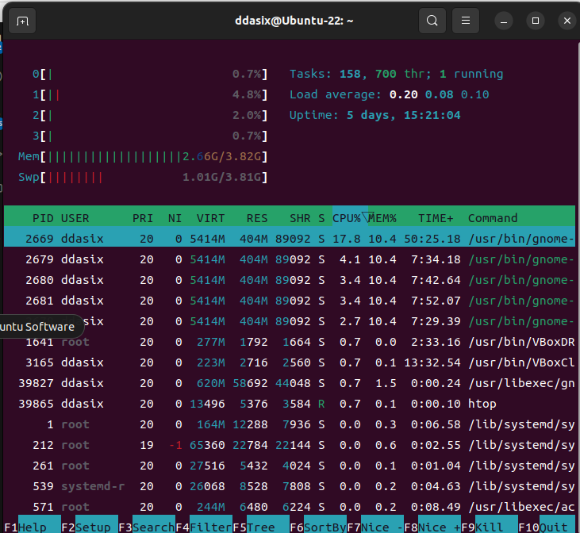

# tesseract-ocr 폰트 학습하기
## Install prerequirement
### 소스코드로 설치하기
+ [Compilation guide for various platforms](https://tesseract-ocr.github.io/tessdoc/Compiling.html)
+ Tesseract 빌드
    1. tesseract 다운로드
    ```bash
    $ git clone https://github.com/tesseract-ocr/tesseract.git
    ```
    2. 최신 태그로 브랜치 변경
    ```bash
    $ git checkout 5.3.4
    ```
    3. 빌드
    ```
    $ cd tesseract
    $ ./autogen.sh
    $ ./configure --disable-debug --disable-opencl --disable-graphics 'CXXFLAGS=-g -O2'
    ```
    ```bash
    # configure 옵션들
    --disable-openmp # 테서랙트를 병렬로 실행할 필요 없을 때 비활성화
    --disable-debug # 디버그모드 비활성화
    --disable-opencl # 지원하는 그래픽카드가 없을경우 비활성화
    --disable-graphics # 지원하는 그래픽카드가 없을경우 비활성화
    --disable-shared
    'CXXFLAGS=-g -O2 -Wall -Wextra -Wpedantic' # 필요하면 컴파일러 옵션 검색
    ```
    ```bash
    # 스레드확인
    $ htop # 없으면 설치
    ```
    
    ```bash
    $ make -j4 # 4개의 스레드가 있으므로...
    $ sudo make install
    $ sudo ldconfig # cuda; 그래픽카드 연결
    $ make training -j4
    $ sudo make training-install
    ```
    
+ 라이브러리설치
    ```bash
    $ sudo apt-get install g++ # or clang++ (presumably)
    $ sudo apt-get install autoconf automake libtool
    $ sudo apt-get install pkg-config
    $ sudo apt-get install libpng-dev
    $ sudo apt-get install libjpeg8-dev
    $ sudo apt-get install libtiff5-dev
    $ sudo apt-get install zlib1g-dev
    $ sudo apt-get install libwebpdemux2 libwebp-dev
    $ sudo apt-get install libopenjp2-7-dev
    $ sudo apt-get install libgif-dev
    $ sudo apt-get install libarchive-dev libcurl4-openssl-dev
    ```
+ 트레이닝툴 설치시 다음 라이브러리도 함께 설치
    ```bash
    $ sudo apt-get install libicu-dev
    $ sudo apt-get install libpango1.0-dev
    $ sudo apt-get install libcairo2-dev
    ```
+ Leptonica 설치
    ```bash
    $ sudo apt-get install libleptonica-dev
    ```
+ langdata 다운로드
    ```bash
    $ git clone https://github.com/tesseract-ocr/langdata_lstm.git
    ```
+ tesstrain 다운로드
    ```bash
    $ git clone https://github.com/tesseract-ocr/tesstrain.git
    ```
## Training Tesseract 5 for a New Font
+ 참고링크
    + [provide-ground-truth-data](https://github.com/tesseract-ocr/tesstrain?tab=readme-ov-file#provide-ground-truth-data)
+ 01.split_training_text.ipynb 실행